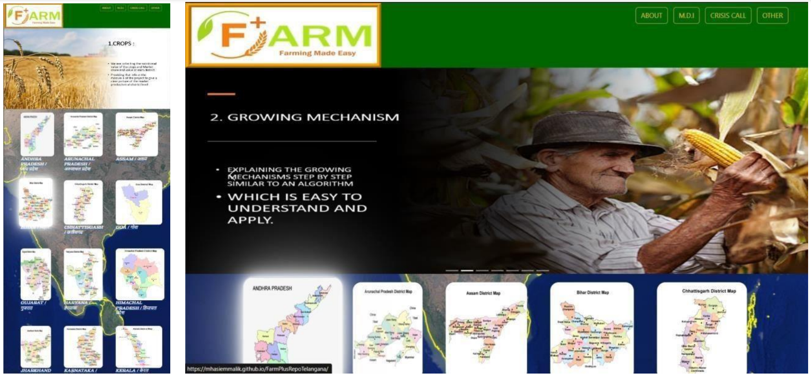
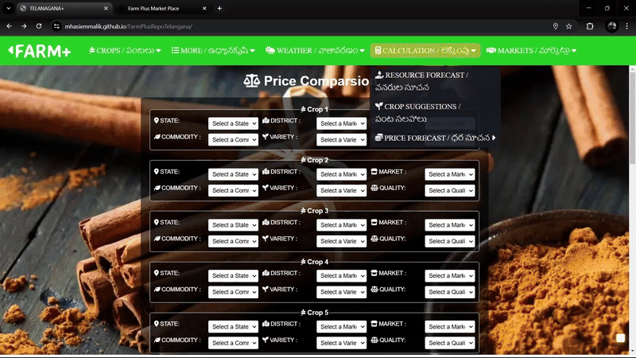
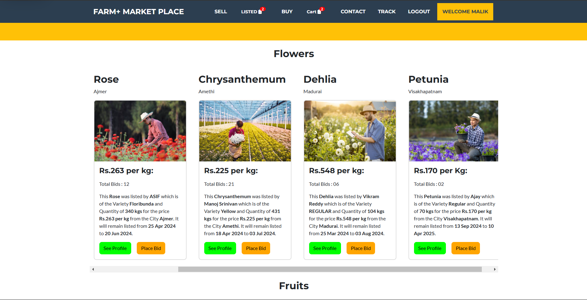

# FARM PLUS {Farming Made Easy}

Visit the site here: [Farmplus Website](https://farmplus.vercel.app/)

## Description

Farm Plus is an enterprise level agricultural platform designed to provide farmers with smart, data-driven solutions. It integrates domains and modules like Crop Management, an online marketplace, machine learning-based crop price prediction tools, weather tracking, and resource forecasting, to help farmers make informed decisions. The platform ensures fair pricing, eliminates middlemen, and enhances market accessibility. Built using modern web technologies, Farm Plus leverages **Python (Flask, Pandas, Scikit-learn)** for machine learning models, **Java Servlets and JSP** for backend development, and **HTML/CSS/JS** for an interactive frontend experience.

## Modules and Pages

### 1. **Home Page**

The home page provides an overview of All the states and Union territories present across the country Each state and unitary buttons act as individual navigations to modules related to that geographical location. Along with an about section which contains tutorial video to explain and walk through each and every module of the project.

### 2. **Crop Management**

#### 2.1 **Highlights Regional Crop Practices**
The module presents best farming techniques based on regional soil conditions, climate, and government policies. It includes data on optimal irrigation, pesticide use, and seasonal farming techniques.

#### 2.2 **Focuses on Nutritional and General Properties of Crops**
Each crop is categorized based on nutritional content, storage requirements, and water consumption, helping farmers choose the best-suited crops for cultivation.

#### 2.3 **Gives Insights on Market Value and Demand Across the Country**
Integrating **machine learning models like Random Forest Regressor**, this module predicts crop prices based on historical data (10-20 years), market demand, and government policies.

.png)

[Visit the Module here](https://mhasiemmalik.github.io/VaveLink001/)

### 3. **Horticulture**

#### 3.1 **Includes Fruits, Flowers, Vegetables, Spices, and Cash Crops**
Provides detailed cultivation practices, pest control techniques, and expected market value of horticultural crops.

#### 3.2 **Growing Mechanism from Seed Selection to Harvesting**
Guides farmers through the entire lifecycle of a crop using AI-based insights, ensuring maximum productivity and efficiency.

#### 3.3 **Linguistic Support with 200+ Languages via Google Translate API**
The multilingual interface ensures accessibility for farmers across different linguistic backgrounds.

.png)

### 4. **Weather Tracking**

#### 4.1 **Keeps Farmers Updated with News and Timely Alerts**
Integrates **real-time weather data APIs** to provide continuous updates on climatic conditions.

#### 4.2 **Offers Hourly Weather Updates for Consecutive 7 Days**
Farmers receive accurate temperature, humidity, and precipitation forecasts, allowing them to plan agricultural activities efficiently.

#### 4.3 **Helps in Tracking Cyclones in Real-Time Using Weather Mapping Facilities**
Utilizes **geospatial data and mapping APIs** to help farmers prepare for extreme weather conditions.

.png)

.png)

### 5. **Calculations & AI-Powered Insights**

#### 5.1 **Resource Forecasting: Water, Seeds, Time, Fertilizers, and Area Needs**
Resource forecasting in FARM PLUS utilizes **historical agricultural data** and 
machine learning models to predict essential inputs for farming. 
The model takes **crop type, soil type, and crop quantity** as inputs and processes them 
to generate five key **outputs: water requirements, seed quantity, time needed, fertilizers, and area required**. 
By analyzing past irrigation trends, soil retention, and climate conditions, 
it estimates **water needs** to optimize irrigation. Seed quantity is calculated based 
on sowing density, while **time required** is predicted using historical growth patterns. 
Fertilizer needs are determined by assessing soil nutrient levels and crop uptake, ensuring 
balanced application. Finally, **area needed** is estimated based on optimal crop spacing and 
expected yield. This data-driven approach helps farmers reduce waste, optimize resources, 
and **improve efficiency**, leading to sustainable and profitable farming practices.

.png)

#### 5.2 **Crop Recommendations Based on Location, Seasons, and Soil Rotation**
The **crop recommendation system** in FARM PLUS is designed to provide data-driven suggestions based on 
**region, soil type, season, and crop name**. Using historical data 
it analyzes **soil composition, climate conditions, and market demand** to recommend **six crops** 
in three key categories. The first category focuses on **soil fertility restoration**, 
suggesting **nitrogen-fixing** crops that restore soil health and improve long-term productivity. 
The second category recommends two **seasonal crops** best suited for the selected 
**Kharif, Rabi, or Zaid season**, ensuring optimal growth conditions. The final category suggests two **high market-value** 
crops based on market trends in the farmer's region, maximizing profitability. This system helps 
farmers **achieve better yields, maintain soil sustainability, and make informed planting decisions** 
for long-term agricultural success.

#### 5.3 **Market Price Prediction and Comparison Tools**
The market price prediction and comparison tools in FARM PLUS utilize **Random Forest Regression**, 
a machine learning algorithm that trains on 
**historical crop prices, supply-demand trends, and inflation data** to provide accurate forecasts. 
The model is trained by splitting data into training and testing sets, 
creating multiple decision trees, and averaging their outputs for precise predictions. 
In price prediction, the system estimates the **market price of a selected crop based on historical trends and real-time factors**, 
helping farmers decide the best time to sell. 
In price comparison, the system allows users to **compare the market prices of five different crops**, 
**visualizing trends through bar graphs**. This enables 
farmers to analyze profitability, select the best crops for cultivation, and 
optimize their selling strategy based on market fluctuations.

### 6. **Marketplace**

#### 6.1 **Marketplace for Selling and Buying Produce Securely Across the Country**

The FARM PLUS marketplace is an innovative digital platform designed to enable secure, seamless, and transparent **buying and selling of agricultural produce across the country**. It empowers farmers by **eliminating middlemen, ensuring fair pricing, and offering a direct connection between sellers and buyers**. The system is user-friendly, supporting **real-time bidding, contract generation, and logistics tracking** to create an efficient and structured trading environment.
1. **Listing Page :** Farmers can list their crops by entering details such as crop type, variety, quantity, price, and images. The system verifies farmer credentials (Aadhaar, PAN) to ensure authenticity and prevent fraud.
2. **Bidding Page :** Buyers can view crop listings and place bids based on their requirements. The system dynamically updates the highest bid in real-time, ensuring a competitive and fair marketplace. Farmers have the option to accept the best bid suited to their needs.
3. **Cart Page :** Buyers can track and manage their bids, view crop details, and finalize purchases before proceeding to the contract stage.
4. **Contract Page :** After bid approval, a digital contract is generated that outlines transaction terms, buyer-seller details, and pricing. This contract can be downloaded or printed, ensuring legal compliance and maintaining transaction security.
5. **Logistics Tracking Page :** Once the transaction is completed, buyers and farmers can track the shipment status in real-time through integrated logistics services. The system provides estimated delivery times, live location tracking, and delivery confirmations to ensure secure and timely transactions.

#### 6.2 **Locates Nearby Cold Storages and Markets**
Uses **GPS-based tracking** to provide real-time data on available storage facilities and market locations.

#### 6.3 **Crisis Call Support for All Types of Emergencies**
Integrated emergency support connects farmers with disaster relief services and government aid programs.

.png)

## Features

1. **Responsive Design**  
   - Optimized for mobile and desktop, ensuring seamless access across devices.

2. **Machine Learning-Based Crop Price Prediction**  
   - Uses **Random Forest Regressor and AI models** to forecast price trends.

3. **Real-Time Weather Tracking**  
   - Fetches and displays weather conditions using **OpenWeather API** and **Geospatial Data APIs**.

4. **Advanced Search and Filtering Tools**  
   - Users can search and compare crop prices, market trends, and government subsidies.

5. **Multilingual and Audio Support**  
   - Google Translate API integration allows farmers to access content in **200+ languages**.

6. **Secure And Seamless Digital Marketplace**  
   - Innovative digital platform designed to enable secure, seamless, and transparent **buying and selling of agricultural produce across the country**. It empowers farmers by **eliminating middlemen, ensuring fair pricing, and offering a direct connection between sellers and buyers**. The system is user-friendly, supporting **real-time bidding, contract generation, and logistics tracking** to create an efficient and structured trading environment.

7. **Crisis Call and Emergency Assistance**  
   - Provides instant connectivity with **NGOs, government aid portals, and disaster response teams**.

8. **Geospatial Market Insights**  
   - Maps regional demand, pricing fluctuations, and soil health analytics.

## Tech Stack

- **Frontend:** React.js, HTML, CSS, JavaScript
- **Backend:** Java Servlets, JSP, Flask (for ML models)
- **Database:** Oracle SQL
- **Machine Learning:** Python (Pandas, NumPy, Scikit-learn), Random Forest Regressor, Data Preprocessing
- **APIs & Integrations:** OpenWeather API, Google Translate API, Blockchain for transactions
- **Hosting & Deployment:** Vercel, Tomcat 9.0 Server

## Usage

Visit [Farm Plus Website](https://mhasiemmalik.github.io/VavelinkHomeRepo/) to explore the platform. Select your state, choose a module, and start optimizing your farming practices today!

## Contributing

Contributions are welcome! Please follow the [contribution guidelines](CONTRIBUTING.md) when submitting pull requests.

## License

This project is licensed under the [MIT License](LICENSE).

## Contact

For any inquiries or support, feel free to contact us at [contact@example.com](mailto:contact@example.com).

## BONUS

Idea And Team Inception Video

<video controls src="./ReadmePics/InceptionOfIDT.mp4" title="Title"></video>